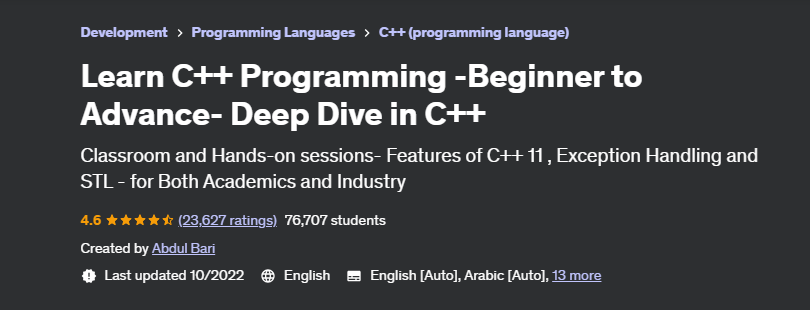

# Learn C++ Programming -Beginner to Advance- Deep Dive in C++
Classroom and Hands-on sessions- Features of C++ 11, Exception Handling and STL - for Both Academics and Industry

## Summary
The content within this repository is my own work produced as a result of completing the course "Learn C++ Programming -Beginner to Advance- Deep Dive in C++" authored by Abdul Bari.
* https://www.udemy.com/course/cpp-deep-dive/

## IDE used
Visual Studio Code

### About me
* George Calin
* george.calin [at] gmail.com
* LinkedIn: https://www.linkedin.com/in/cgeorge1978/
